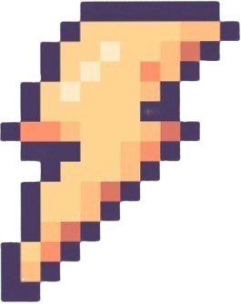
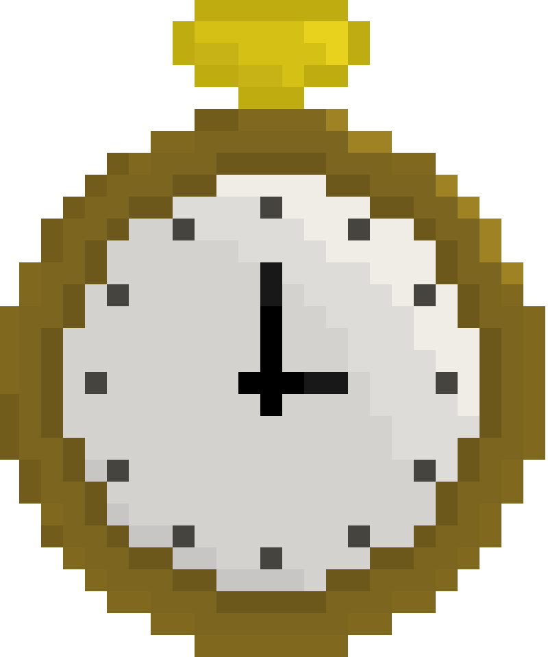

## 💣 Avoiding-Bomb 


> 성공회대학교 2024-2학기 오픈소스SW개발 Team Delta  
> 개발 기간: 2024.09 ~ 2024.12 

## 📑 목차
- [개요](#개요)
- [게임 시작 가이드](#게임-시작-가이드)
- [게임 플레이 방식](#게임-플레이-방식)

## 개요
- 프로젝트 이름: **Avoiding-Bomb**
- 프로젝트 개발 기간: **2024.09 ~ 2024.12**
- 개발 환경 및 언어  
           

### Team Delta ☃️

|박주원|이정혁|이 진|최다연|
|:---:|:---:|:---:|:---:|
|[@juwon02](https://github.com/juwon02)|[@likevanilla](https://github.com/likevanilla)|[@jine531](https://github.com/jine531)|[@choi-day](https://github.com/choi-day)|

  
## 게임 시작 가이드

### VSCode 설치 및 확장 프로그램 설치
- [공식 홈페이지](https://visualstudio.microsoft.com/ko/)에서 VSCode를 다운로드하고 설치합니다.
- VSCode를 실행하고, 왼쪽 사이드바의 `확장` 아이콘을 클릭하여 확장 탭으로 이동합니다.
- 검색창에 `Python`을 입력하고, `Python` 확장을 설치합니다.

### Github 레포지토리 복제
- 해당 레포지토리 메인 화면 오른쪽 상단 초록색 버튼 `Code`를 클릭합니다.
- URL을 복사합니다.
- VSCode에서 왼쪽 사이드바에서 `소스 관리` 아이콘을 클릭합니다.
- `Git: Clone` 또는 `레포지토리 복제`를 선택하고 복사한 URL을 붙여넣습니다.
- 저장할 위치를 선책하고 Clone 합니다. 

### pygame 설치

- VSCode에서 왼쪽 사이드바의 `확장` 아이콘을 클릭하여 확장 탭으로 이동합니다.
- 검색창에 `Pygame`을 입력하고, `Pygame Snippets` 확장을 설치합니다.
- 또는 터미널에 다음 명령어를 실행합니다.
```
pip install pygame
```


### 게임 실행

- bomb_game 파일에서 bomb_game.py를 선택한 후 상단 메뉴에서 RUN-> Start Without Debugging을 선택합니다.
- 또는 터미널에 다음 명령어를 실행합니다.
```
python bomb_game/bomb_game.py
```

## 게임 플레이 방식

|||
|:---:|:---:|
|시작 화면|플레이 화면|

### 캐릭터 이동 방법

|이동방향|왼쪽(좌)|오른쪽(우)|
|:---:|:---:|:---:|
|방향키|⬅️|➡️|

- 캐릭터가 벽에 들어가면 반대쪽 벽에서 나옵니다.

### 🔜 인트로 

- `Start` 버튼을 누르면 게임이 시작됩니다.   
- `Quit` 버튼을 누르면 게임을 종료합니다.

### 🔛 게임 플레이 

### ➕
|번개|별|시계|하트|
|:---:|:---:|:---:|:---:|
|||||
|캐릭터의 이동속도가 빨라집니다.|잠시동안 폭탄과 충돌하지 않습니다.|잠시동안 폭탄의 낙하 속도를 늦춥니다.|생명을 1개 추가해줍니다.|

### ➖
|폭탄|다이너마이트|거북이|
|:---:|:---:|:---:|
||||
|생명이 1개 깎입니다.|생명이 2개 깎입니다.|캐릭터의 이동속도가 느려집니다.|

- 게임 플레이 도중에 키보드에서 `Space bar`를 누르면 게임이 일시정지됩니다.   
  다시 `space bar`를 누르게 되면 3초 뒤에 게임이 재개됩니다.

### 🔚 게임 종료 

- 살아남은 시간으로 자신만의 기록을 세워보세요!   
- `RE?` 버튼을 누르면 게임이 재시작됩니다.   
- `Quit`  버튼을 누르면 게임을 종료합니다.


## License

This project is licensed under the terms of the [MIT license](./LICENSE).
