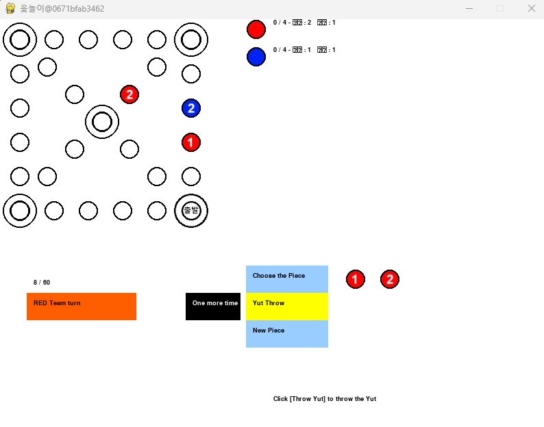
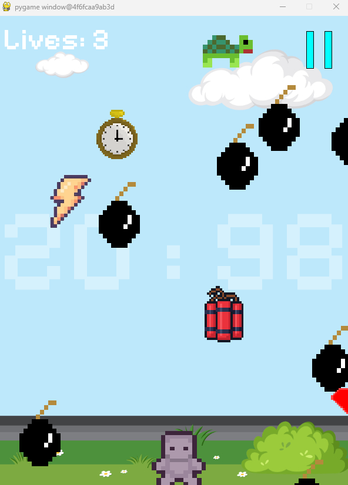
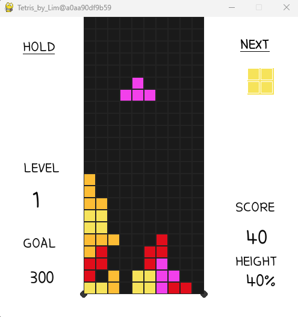

# 2025-OSS
2024 OSS 과제물을 바탕으로 일부 수정

[VcXsrv Windows X Server](https://sourceforge.net/projects/vcxsrv/)

```bash
xhost +
```

```bash
docker build -t [pygame-alpha]
```

```bash
docker run -it --env="DISPLAY=[default switch(vLan)172.20.80.1]:0" -v /tmp/.X11-unix:/tmp/.X11-unix [이미지pygame-alpha] bash
```

# 게임 설명
## Alpha

2인용, 3인용, 4인용 윷놀이 게임이다.

```bash
apt install python3-pygame # Linux
pip install pygame # Windows

python3 src/main.py
```



---

## Delta

하늘에서 떨어지는 폭탄들을 피해 오랫동안 생존하는 게임이다.

```bash
apt install python3-pygame # Linux
pip install pygame # Windows

python3 bomb_game.main.py
```

<aside>
💡

왼쪽, 오른쪽 화살표 키로 캐릭터를 이동한다.

spacebar로 게임을 잠시 중지한다.

</aside>



---

## Echo

테트리스 게임이다. 

높이의 60% 이상 블럭이 도달한다면 배경이 빨간색으로 점멸한다.

```bash
apt install python3-pygame # Linux
pip install pygame # Windows

python3 Tetris_Pygame-master/tetris.py
```

<aside>
💡

왼쪽, 오른쪽 화살표 키로 캐릭터를 이동한다.

위쪽 화살표 키로 블럭을 회전한다.

아래쪽 화살표 키로 블럭이 빠르게 내려오게 한다.

spacebar로 블럭을 바로 내린다.

Q를 눌러 잠시 게임을 멈춘다.

</aside>


